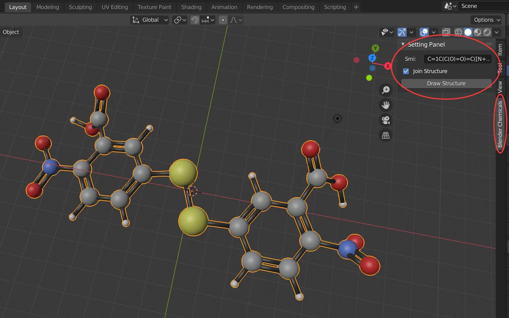
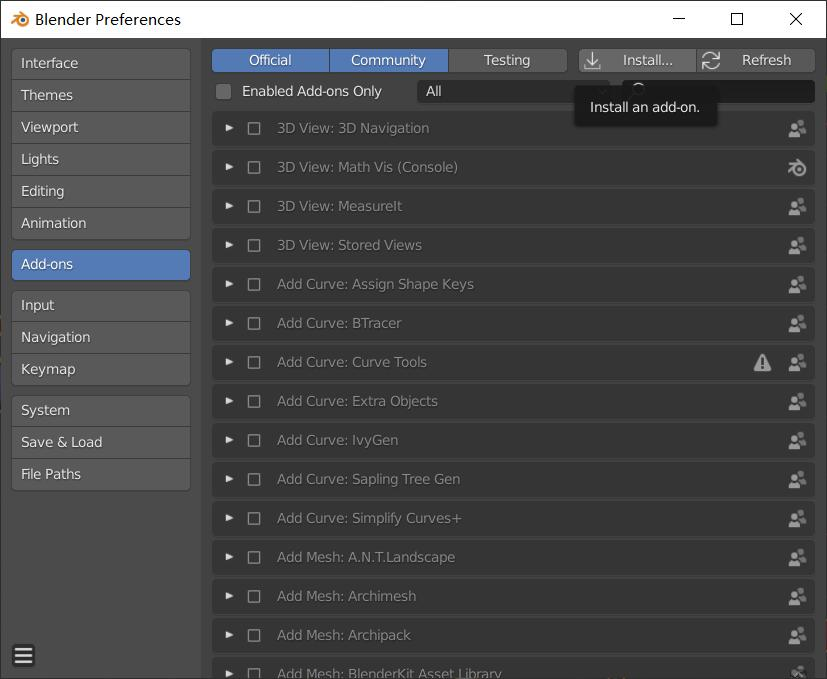

# blender_chemicals

blender_chemicals 是一个基于blender-chemicals[^1]的插件，可以用来将SMILE格式的分子转换成3D的结构。但是由于Blender最新版的python api和以往相差较多，因此blender-chemicals已经无法使用，会产生很多的错误。因此，我将blender-chemicals进行修改，并转换成适应最新Blender的一个插件，其界面如下图所示。




安装支持软件
---
这个Blender插件对于smile格式的转换是基于Openbabel的，因此需要安装openbabel，但是这个软件的安装，非常容易出错，因此，推荐严格按照如下的方法进行安装。

* 安装Anaconda[^2]
* 使用conda命令安装openbabel

```bash
conda install -c openbabel openbabel
```

安装完成之后，在python环境中执行如下的命令，看看是否出错，出错代表没有安装成功

```python
import pybel
import openbabel
```

安装blender_chemicals
---
- 下载blender_chemicals，并压缩成一个zip文件。
- 在Blender中将这个zip文件安装一个插件的方式进行安装[Edit]-[Preferences]-[Addon] as below.



- 按 <kbd>N</kbd> 键展示插件的设置和输入面板。

支持
---
可以使用 <https://cactus.nci.nih.gov/cgi-bin/osra/index.cgi> 来创建或者转换SMILE格式

[^1]: <https://github.com/patrickfuller/blender-chemicals>
[^2]: <https://conda.io/projects/conda/en/latest/user-guide/install/windows.html>